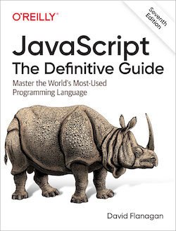

# Example code from _JavaScript: The Definitive Guide_

This repo includes all of the numbered examples from the 7th edition
of my book, plus many unnumbered examples as well. In general, if an
unnumbered example defines a function that seems like it might be
useful to someone, I've included it here. The code is listed below in
roughly the same order as in the book. To locate code, just look below
for the example number or section number that the code appears in.

This code is far more useful when studied in the context of the book
in which it appears, and I'd ask you to [please buy yourself a
copy](https://amzn.to/3fTETLV) if you are able to. These examples are
[free for everyone to use](LICENSE.md).

If you discover problems with this repo, or bugs in the code, please
open a GitHub issue. (Note, however, that I will not accept pull
requests because I need to maintain clear copyright to the code so
that I can use it in future editions of the book.)

## Chapter 1: Introduction to JavaScript
- [Example 1-1](ch01/charfreq.js): Computing character frequency histograms with JavaScript

## Chapter 3: Types, Values, and Variables

- [§3.10.3](ch03/destructuring.js): Destructuring Assignment

## Chapter 6: Objects

- [§6.7](ch06/merge.js): Extending Objects
- §6.10.6: Property Getters and Setters
    - [serialnum.js](ch06/serialnum.js)
    - [random.js](ch06/random.js)

## Chapter 7: Arrays

- [§7.8.6](ch07/findall.js): Array Searching and Sorting Methods
- [§7.9](ch07/isArrayLike.js): Array-Like Objects

## Chapter 8: Functions

- [§8.1](ch08/example_functions.js): Defining Functions
- [§8.3.4](ch08/timed.js): The Spread Operator for Function Calls
- [§8.3.5](ch08/arraycopy.js): Destructuring Function Arguments into Parameters
- [Example 8-1](ch08/operators.js): Using functions as data
- §8.4.1 Defining Your Own Function Properties
    - [uniqueInteger](ch08/uniqueInteger.js)
    - [factorial](ch08/factorial.js)
- §8.6 Closures
    - [uniqueInteger2](ch08/uniqueInteger2.js)
    - [counter](ch08/counter.js)
    - [counter 2](ch08/counter2.js)
- [Example 8-2](ch08/addPrivateProperty.js): Private property accessor methods using closures
- [§8.7.4](ch08/trace.js): The call() and apply() Methods
- §8.8.1: Processing Arrays with Functions
    - [stats1](ch08/stats1.js)
    - [stats2](ch08/stats2.js)
    - [stats3](ch08/stats3.js)
- §8.8.2: Higher-Order Functions
    - [not](ch08/not.js)
    - [mapper](ch08/mapper.js)
    - [compose](ch08/compose.js)
- [§8.8.3](ch08/partial.js): Partial Application of Functions
- [§8.8.4](ch08/memoize.js): Memoization

## Chapter 9: Classes

- [Example 9-1](ch09/range1.js): A simple JavaScript class
- [Example 9-2](ch09/range2.js): A Range class using a constructor
- [Example 9-3](ch09/range3.js): The Range class rewritten using _class_
- [Example 9-4](ch09/Complex.js): Complex.js: a complex number class
- [Example 9-5](ch09/Span.js): Span.js: a simple subclass of Range
- §9.5.2: Subclasses with extends and super
    - [EZArray](ch09/EZArray.js)
- [Example 9-6](ch09/TypedMap.js): TypedMap.js: a subclass of Map that checks key and value types
- [Example 9-7](ch09/Histogram.js): Histogram.js: a Set-like class implemented with delegation
- [Example 9-8](ch09/Sets.js): Sets.js: a hierarchy of abstract and concrete set classes

## Chapter 10: Modules

- §10.1: Modules with Classes, Objects, and Closures
    - [BitSet](ch10/BitSet.js)
    - [stats](ch10/stats.js)

## Chapter 11: The JavaScript Standard Library

- [§11.2.3](ch11/sieve.js): Using Typed Arrays
- [§11.2.5](ch11/littleEndian.js): DataView and Endianness

## Chapter 12: Iterators and Generators

- [Example 12-1](ch12/Range.js): An iterable numeric Range class
- §12.2: Implementing Iterable Objects
    - [map](ch12/map.js)
    - [filter](ch12/filter.js)
    - [words](ch12/words.js)
- §12.3.1: Generator Examples
    - [fibonacciSequence](ch12/fibonacciSequence.js)
    - [take](ch12/take.js)
    - [zip](ch12/zip.js)
- §12.3.2 yield* and Recursive Generators
    - [sequence](ch12/sequence.js)

## Chapter 13: Asynchronous JavaScript

- §13.1.4: Callbacks and Events in Node
    - [getText](ch13/getText.js)
- §13.2.6: Making Promises
    - [wait](ch13/wait.js)
- [Example 13-1](ch13/getJSON.js): An asynchronous getJSON() function
- §13.2.7 Promises in Sequence
    - [fetchSequentially](ch13/fetchSequentially.js)
    - [promiseSequence](ch13/promiseSequence.js)
- §13.4.3: Asynchronous Generators
    - [clock1](ch13/clock1.js)
- §13.4.4:  Implementing Asynchronous Iterators
    - [clock2](ch13/clock2.js)
    - [AsyncQueue](ch13/AsyncQueue.js)

## Chapter 14: Metaprogramming

- [Example 14-1](ch14/assignDescriptors.js): Copying properties and their attributes from one object to another
- §14.4.3: Symbol.toStringTag
    - [classof](ch14/classof.js)
- §14.4.6: Pattern-Matching Symbols
    - [Glob](ch14/Glob.js)
- §14.5: Template Tags
    - [html](ch14/html.js)
    - [glob](ch14/globtag.js)
- §14.7: Proxy Objects
 - [identity](ch14/identity.js)
 - [readOnlyProxy](ch14/readOnlyProxy.js)
 - [loggingProxy](ch14/loggingProxy.js)

## Chapter 15: JavaScript in Web Browsers

- §15.1.1: JavaScript in HTML <script> Tags
    - [digital clock](ch15/digital_clock.html)
    - [importScript](ch15/importScript.js)
- §15.2.2: Registering Event Handlers
    - [onload](ch15/onload.js)
- §15.3.2: Document Structure and Traversal
    - [traverse](ch15/traverse.js)
    - [textContent](ch15/textContent.js)
- [Example 15-1](ch15/TOC.js): Generating a table of contents with the DOM API
- §15.4.4: Scripting Stylesheets
    - [setTheme](ch15/setTheme.js)
- [Example 15-2](ch15/inline-circle.js): The <inline-circle> custom element
- [Example 15-3](ch15/search-box.js): Implementing a web component
- §15.7.1: SVG in HTML
    - [clock face](ch15/clock.html)
- §15.7.2: Scripting SVG
    - [clock motion](ch15/clock.js)
- [Example 15-4](ch15/pieChart.js): Drawing a pie chart with JavaScript and SVG
- [Example 15-5](ch15/polygons.js): Regular polygons with moveTo(), lineTo(), and closePath()
- [Example 15-6](ch15/curves.js): Adding curves to a path
- §15.8.5: Coordinate System Transforms
    - [shear() and rotateAbout()](ch15/transforms.js)
- [Example 15-7](ch15/koch.js): A Koch snowflake with transformations
- [§15.8.6](ch15/clip.js): Clipping
- [Example 15-8](ch15/smear.js): Motion blur with ImageData
- [§15.9.2](ch15/webaudio.js): The WebAudio API
- [Example 15-9](ch15/guessinggame.html): History management with pushState()
- §15.11.1: fetch()
    - [error handling](ch15/fetchWithErrorHandling.js)
    - [request parameters](ch15/settingRequestParameters.js)
    - [request headers](ch15/settingRequestHeaders.js)
    - [file upload](ch15/uploadCanvasImage.js)
    - [with timeout](ch15/fetchWithTimeout.js)
- [Example 15-10](ch15/streamBody.js): Streaming the response body from a fetch() request
- [Example 15-11](ch15/chatClient.html): A simple chat client using EventSource
- [Example 15-12](ch15/chatServer.js): A Server Sent Events chat server
- §15.12.2: Cookies
    - [getCookies](ch15/getCookies.js)
    - [setCookie](ch15/setCookie.js)
- [Example 15-13](ch15/zipcodeDatabase.js): A IndexedDB database of US postal codes
    - [zipcode data](ch15/zipcodes.json)
    - [test program](ch15/zipcodes.html)
- [Example 15-14](ch15/mandelbrotWorker.js): Worker code for computing regions of the Mandelbrot set
- [Example 15-15](ch15/mandelbrot.js): A web application for displaying and exploring the Mandelbrot set
    - [mandelbrot.html](ch15/mandelbrot.html)

## Chapter 16: Server-Side JavaScript with Node

- §16.2: Node Is Asynchronous by Default
    - [readConfigFile](ch16/readConfigFile.js)
    - [readConfigFile2](ch16/readConfigFile2.js)
    - [readConfigFile3](ch16/readConfigFile3.js)
    - [readConfigFileSync](ch16/readConfigFileSync.js)
- §16.5.1: Pipes
    - [pipe](ch16/pipe.js)
    - [gzip](ch16/gzip.js)
    - [grep](ch16/grep.js)
- §16.5.2: Asynchronous Iteration
    - [asyncgrep](ch16/asyncgrep.js)
- §16.5.3: Writing to Streams and Handling Backpressure
    - [write](ch16/write.js)
    - [copy](ch16/copy.js)
- §16.5.4: Reading Streams with Events
    - [copyfile](ch16/copyfile.js)
    - [hash](ch16/hash.js)
- §16.7.6: Working with Directories
    - [listDirectory](ch16/listDirectory.js)
- §16.8 HTTP: Clients and Servers
    - [postJSON](ch16/postJSON.js)
    - [staticHTTPServer](ch16/staticHTTPServer.js)
- §16.9: Non-HTTP Network Servers and Clients
    - [knockKnockServer](ch16/knockKnockServer.js)
    - [knockKnockClient](ch16/knockKnockClient.js)
- §16.10.2: exec() and execFile()
    - [parallelExec](ch16/parallelExec.js)
- §16.10.4: fork()
    - [parent](ch16/parent.js)
    - [child](ch16/child.js)
- §16.11.1: Creating Workers and Passing Messages
    - [splines](ch16/splines.js)
- §16.11.5: Sharing Typed Arrays Between Threads
    - [incorrect parallel increment](ch16/parallelIncrement.js)
    - [atomic increment](ch16/atomicIncrement.js)
